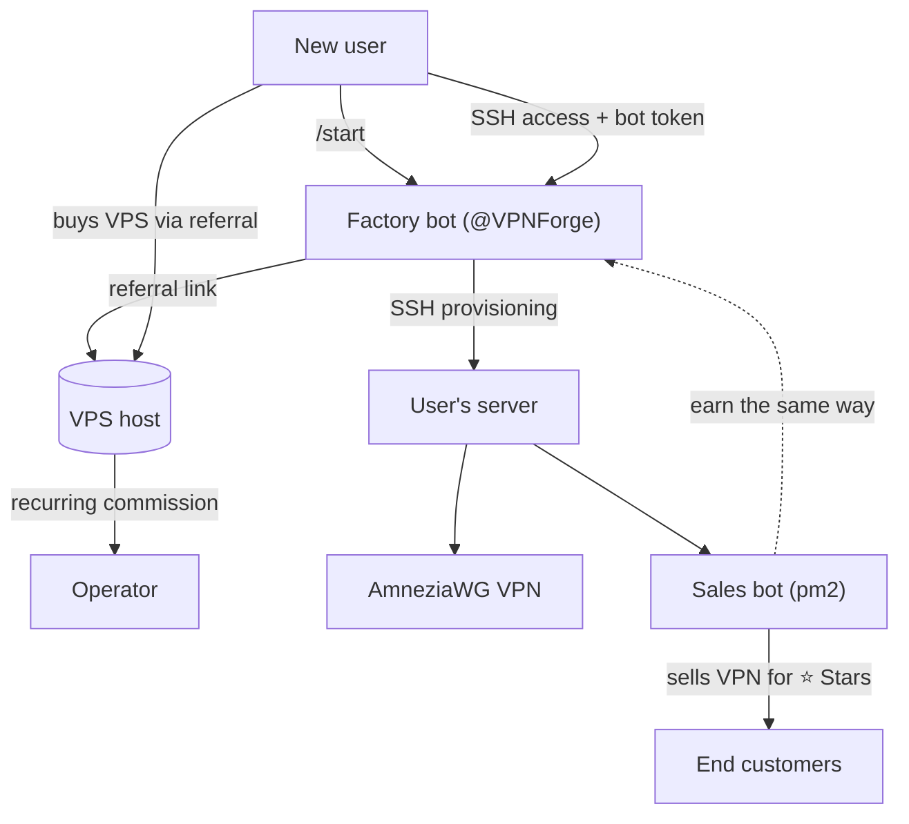

# VPN Franchise 🛰️

**English** · [Русский](README.ru.md)

> A Telegram-bot platform that turns anyone into a VPN reseller. A "factory" bot provisions a
> DPI-resistant **AmneziaWG** VPN **and** a ready-to-run sales bot onto a user's own server — fully
> automatically over SSH — monetized through a hosting referral program and Telegram Stars.

<p>
  
  
  
  
  
</p>

---

## What it does

Most people who want a VPN can't set one up — and running a VPN business is even harder. This project
collapses both into a two-minute Telegram flow:

1. A user opens the **factory bot**, buys a cheap VPS through a referral link, and hands the bot SSH access.
2. The factory bot connects over SSH and **provisions everything itself**: installs AmneziaWG, then
   deploys a **sales bot** onto the user's server and starts it under `pm2`.
3. The user now owns a turnkey VPN business — their bot sells access for **Telegram Stars** and invites
   its own customers to become resellers, closing a viral referral loop.

The operator earns a recurring commission on every referred hosting payment; each node operator keeps
their Stars revenue. Real product at every level — an affiliate model, not a pyramid.

## Architecture



Two independently deployable services, each with a single responsibility:

| Service | Runs on | Responsibility |
|---|---|---|
| **`stanok-bot`** (factory) | operator's server, 24/7 | onboarding, SSH provisioning, deploying sales bots, credential storage |
| **`seller-bot`** (sales) | each node's server | selling VPN for Stars, minting VPN configs, owner analytics |

## Key features

- **Zero-touch provisioning** — the factory bot installs the VPN and deploys the sales bot over SSH; the node operator never touches a terminal.
- **AmneziaWG** — obfuscated WireGuard that resists DPI blocking; installed headless, peers managed directly via `awg`.
- **Telegram Stars payments** — native `XTR` invoices, pre-checkout and delivery handled end-to-end.
- **Encrypted at rest** — node root credentials are stored with **AES-256-GCM**; the key never leaves the server.
- **Flexible config delivery** — QR, `.conf` file, or text, chosen by the user.
- **Owner analytics** — sales, revenue and live-peer counts, gated to the bot owner by Telegram ID.
- **Self-cleaning UX** — single evolving messages, no chat clutter.
- **Tested core** — Jest unit tests for validation, crypto and parsing.

## Tech stack

TypeScript · Node.js 22 (ESM) · [grammY](https://grammy.dev) · better-sqlite3 · AmneziaWG / WireGuard ·
Telegram Stars · pm2 · Jest

## Repository structure

```
vpn-franchise/
├── stanok-bot/                 # Factory bot
│   ├── src/
│   │   ├── index.ts            # Entry, handlers, routing
│   │   ├── onboarding.ts       # Conversation: collect server access (validated)
│   │   ├── provision.ts        # Orchestrates install + sales-bot deploy
│   │   ├── ssh.ts              # Remote install over SSH
│   │   ├── deploy-seller.ts    # Deploys the sales bot to a node server
│   │   ├── crypto-core.ts      # AES-256-GCM (pure, testable)
│   │   ├── crypto.ts           # Crypto bound to config
│   │   ├── db.ts               # SQLite persistence
│   │   ├── validate.ts         # Input validation
│   │   ├── config.ts           # Typed environment config
│   │   ├── constants.ts        # Infra constants (no magic values)
│   │   ├── admin.ts            # Admin error alerts
│   │   └── *.test.ts           # Jest unit tests
│   └── scripts/install-amneziawg.sh
├── seller-bot/                 # Sales bot (deployed onto node servers)
│   ├── src/
│   │   ├── index.ts            # Menu, payments, delivery
│   │   ├── vpn.ts              # Creates AmneziaWG peers
│   │   ├── delivery.ts         # Config delivery: QR / file / text
│   │   ├── stats.ts            # Owner analytics
│   │   ├── owner.ts            # Owner identification
│   │   ├── owner-config.ts     # Owner's reusable config
│   │   └── config.ts · constants.ts · parse.ts
│   └── scripts/add-amneziawg-peer.sh
└── deploy-stanok.sh            # One-command deploy of the factory bot
```

## Getting started

**Prerequisites:** Node.js 22+, a Telegram bot token from [@BotFather](https://t.me/BotFather).

```bash
# Factory bot
cd stanok-bot
npm install
cp .env.example .env      # set BOT_TOKEN and ADMIN_IDS
npm run typecheck
npm test
npm run dev
```

```bash
# Sales bot (normally deployed automatically by the factory bot)
cd seller-bot
npm install
cp .env.example .env      # set SELLER_BOT_TOKEN
npm run dev
```

### Configuration

| Variable | Service | Description |
|---|---|---|
| `BOT_TOKEN` | factory | Factory bot token |
| `ADMIN_IDS` | factory | Telegram IDs that receive error alerts |
| `ENCRYPTION_KEY` | factory | 64 hex chars; auto-generated if omitted |
| `REFERRAL_LINK` | factory | Hosting referral link shown to users |
| `SELLER_PRICE_STARS` | factory | Price the deployed sales bots charge |
| `SELLER_BOT_TOKEN` | sales | Sales bot token (injected on deploy) |
| `OWNER_ID` | sales | Owner's Telegram ID (injected on deploy) |

## Deployment

Run the factory bot on an always-on server (outside jurisdictions that block Telegram):

```bash
./deploy-stanok.sh <SERVER_IP>
```

The script packages the code, installs Node + pm2 on the remote host, runs `npm install`, and starts
the bot under `pm2` with restart-on-reboot. Re-run it to ship updates.

## How provisioning works

The interesting part is `stanok-bot` acting as a remote deployer. On demand it:

1. Connects to the node's server via SSH using decrypted credentials.
2. Runs a headless AmneziaWG installer and verifies a client config is produced.
3. Uploads the `seller-bot` source (excluding `node_modules`), installs dependencies, writes an
   `.env`, and starts it under `pm2` — all idempotently.
4. Reports the running bot's link back to the user and alerts admins on any failure.

VPN peers are then created directly through `awg` on the node, so each customer gets a unique,
revocable config without any interactive tooling.

## Security

- Node credentials are encrypted with AES-256-GCM before storage.
- Secrets (`.env`, keys, databases) are git-ignored and never logged.
- Access to owner-only features (analytics, free VPN) is verified by Telegram ID on both the UI and handler level.

## Testing

```bash
cd stanok-bot && npm test
```

Pure logic — input validation, encryption round-trips, and output parsing — is isolated from I/O and
covered by Jest.

## Roadmap

- [x] Subscription expiry and automatic peer revocation
- [x] Node health monitoring with admin alerts
- [x] Owner-configurable pricing
- [ ] Native Amnezia `vpn://` one-line keys
- [ ] Multi-region endpoints

## Disclaimer

Built as an engineering portfolio project. VPN and reselling regulations vary by jurisdiction — use it
where it is lawful to do so.

## License

[MIT](LICENSE)
# vpn-stanok
