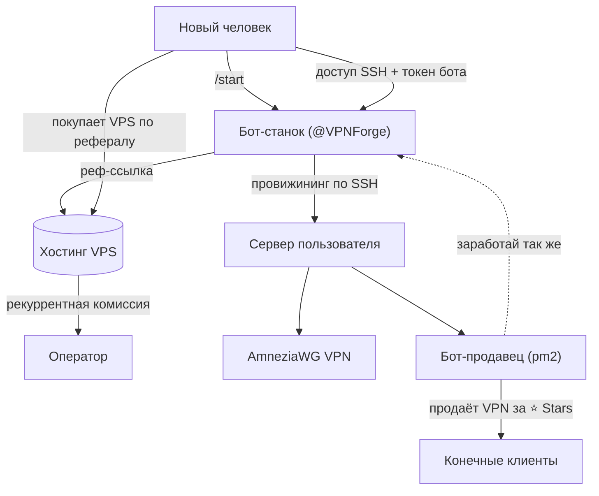

# VPN Franchise 🛰️

[English](README.md) · **Русский**

> Платформа на Telegram-ботах, которая превращает любого в реселлера VPN. Бот-«станок»
> автоматически, по SSH, разворачивает на сервере пользователя устойчивый к DPI **AmneziaWG** VPN
> **и** готового бота-продавца — монетизация через реферальную программу хостинга и Telegram Stars.

<p>
  
  
  
  
  
</p>

---

## Что это

Большинству людей, которым нужен VPN, сложно его поднять — а вести VPN-бизнес ещё сложнее. Проект
сводит и то, и другое к двухминутному сценарию в Telegram:

1. Человек открывает **бота-станок**, покупает дешёвый VPS по реферальной ссылке и отдаёт боту доступ по SSH.
2. Станок подключается по SSH и **настраивает всё сам**: ставит AmneziaWG, затем разворачивает на
   сервере пользователя **бота-продавца** и запускает его под `pm2`.
3. У человека готовый VPN-бизнес под ключ — его бот продаёт доступ за **Telegram Stars** и зовёт своих
   клиентов тоже стать реселлерами, замыкая виральную реферальную петлю.

Оператор получает рекуррентную комиссию с каждого реферального платежа за хостинг; владелец узла
оставляет себе выручку в Stars. На каждом уровне реальный продукт — это аффилиатная модель, а не пирамида.

## Архитектура



Два независимо развёртываемых сервиса, у каждого — своя единственная зона ответственности:

| Сервис | Где работает | Ответственность |
|---|---|---|
| **`stanok-bot`** (станок) | сервер оператора, 24/7 | онбординг, провижининг по SSH, деплой ботов-продавцов, хранение доступов |
| **`seller-bot`** (продавец) | сервер каждого узла | продажа VPN за Stars, генерация конфигов, статистика владельцу |

## Возможности

- **Провижининг без рук** — станок ставит VPN и разворачивает продавца по SSH; владелец узла не открывает терминал.
- **AmneziaWG** — обфусцированный WireGuard, устойчивый к DPI; ставится headless, пиры создаются напрямую через `awg`.
- **Оплата Telegram Stars** — нативные инвойсы `XTR`, pre-checkout и выдача — сквозной сценарий.
- **Шифрование при хранении** — root-доступы узлов лежат под **AES-256-GCM**; ключ не покидает сервер.
- **Гибкая выдача конфига** — QR, файл `.conf` или текст на выбор.
- **Статистика владельцу** — продажи, выручка и живые пиры, доступ по Telegram ID.
- **Чистый UX** — сообщения редактируются на месте, чат не засоряется.
- **Покрытый тестами кор** — Jest на валидацию, шифрование и парсинг.

## Стек

TypeScript · Node.js 22 (ESM) · [grammY](https://grammy.dev) · better-sqlite3 · AmneziaWG / WireGuard ·
Telegram Stars · pm2 · Jest

## Структура репозитория

```
vpn-franchise/
├── stanok-bot/                 # Бот-станок
│   ├── src/
│   │   ├── index.ts            # Точка входа, хендлеры, роутинг
│   │   ├── onboarding.ts       # Диалог: сбор доступов (с проверками)
│   │   ├── provision.ts        # Оркестрация: установка + деплой продавца
│   │   ├── ssh.ts              # Удалённая установка по SSH
│   │   ├── deploy-seller.ts    # Деплой продавца на сервер узла
│   │   ├── crypto-core.ts      # AES-256-GCM (чистый, тестируемый)
│   │   ├── crypto.ts           # Крипто, привязанное к конфигу
│   │   ├── db.ts               # Хранилище SQLite
│   │   ├── validate.ts         # Валидация ввода
│   │   ├── config.ts           # Типизированный конфиг из env
│   │   ├── constants.ts        # Константы инфры (без «магии»)
│   │   ├── admin.ts            # Алерты об ошибках админу
│   │   └── *.test.ts           # Jest-тесты
│   └── scripts/install-amneziawg.sh
├── seller-bot/                 # Бот-продавец (ставится на серверы узлов)
│   ├── src/
│   │   ├── index.ts            # Меню, оплаты, выдача
│   │   ├── vpn.ts              # Создание пиров AmneziaWG
│   │   ├── delivery.ts         # Выдача конфига: QR / файл / текст
│   │   ├── stats.ts            # Статистика владельцу
│   │   ├── owner.ts            # Определение владельца
│   │   ├── owner-config.ts     # Переиспользуемый конфиг владельца
│   │   └── config.ts · constants.ts · parse.ts
│   └── scripts/add-amneziawg-peer.sh
└── deploy-stanok.sh            # Деплой станка одной командой
```

## Быстрый старт

**Требования:** Node.js 22+, токен бота от [@BotFather](https://t.me/BotFather).

```bash
# Бот-станок
cd stanok-bot
npm install
cp .env.example .env      # задай BOT_TOKEN и ADMIN_IDS
npm run typecheck
npm test
npm run dev
```

```bash
# Бот-продавец (обычно его разворачивает станок автоматически)
cd seller-bot
npm install
cp .env.example .env      # задай SELLER_BOT_TOKEN
npm run dev
```

### Конфигурация

| Переменная | Сервис | Описание |
|---|---|---|
| `BOT_TOKEN` | станок | Токен бота-станка |
| `ADMIN_IDS` | станок | Telegram ID, куда идут алерты об ошибках |
| `ENCRYPTION_KEY` | станок | 64 hex-символа; сгенерится сам, если не задан |
| `REFERRAL_LINK` | станок | Реферальная ссылка хостинга |
| `SELLER_PRICE_STARS` | станок | Цена, которую берут развёрнутые продавцы |
| `SELLER_BOT_TOKEN` | продавец | Токен продавца (проставляется при деплое) |
| `OWNER_ID` | продавец | Telegram ID владельца (проставляется при деплое) |

## Деплой

Станок должен работать на постоянном сервере (вне юрисдикций, блокирующих Telegram):

```bash
./deploy-stanok.sh <IP_СЕРВЕРА>
```

Скрипт пакует код, ставит на удалённом хосте Node + pm2, запускает `npm install` и поднимает бота под
`pm2` с автостартом после ребута. Для обновления — запусти повторно.

## Как устроен провижининг

Самое интересное — `stanok-bot` в роли удалённого деплоера. По запросу он:

1. Подключается к серверу узла по SSH, используя расшифрованные доступы.
2. Запускает headless-установщик AmneziaWG и проверяет, что клиентский конфиг создан.
3. Заливает исходники `seller-bot` (без `node_modules`), ставит зависимости, пишет `.env` и запускает
   под `pm2` — идемпотентно.
4. Отдаёт пользователю ссылку на его бота и шлёт алерт админам при любой ошибке.

Дальше пиры VPN создаются напрямую через `awg` на узле — каждый клиент получает уникальный,
отзываемый конфиг без интерактивных инструментов.

## Безопасность

- Доступы узлов шифруются AES-256-GCM до записи в базу.
- Секреты (`.env`, ключи, базы) в `.gitignore` и не пишутся в логи.
- Доступ к функциям владельца (статистика, бесплатный VPN) проверяется по Telegram ID и на UI, и в хендлере.

## Тесты

```bash
cd stanok-bot && npm test
```

Чистая логика — валидация, шифрование, парсинг — изолирована от I/O и покрыта Jest.

## Дорожная карта

- [ ] Нативные однострочные ключи Amnezia `vpn://`
- [ ] Срок подписки и отзыв пиров
- [ ] Мониторинг состояния узлов
- [ ] Точки выхода в нескольких регионах

## Дисклеймер

Сделано как инженерный портфолио-проект. Регулирование VPN и реселла отличается по юрисдикциям —
используйте там, где это законно.

## Лицензия

[MIT](LICENSE)
